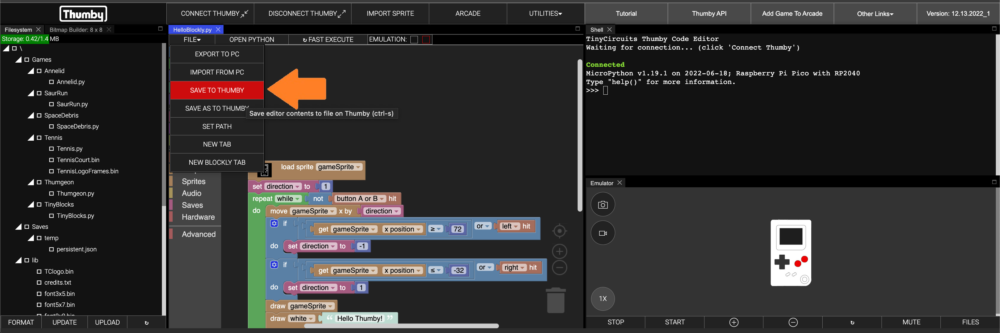
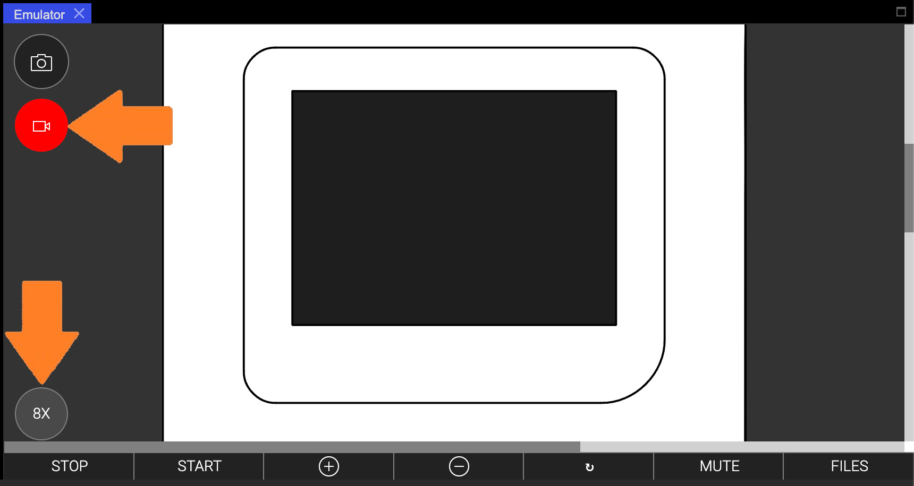

# Publish Your Game

---

So far, we've only shown you how to test your games in the emulator, or run tests on a connected Thumby. It's about time we showed you how to properly load your games onto the Thumby, and also how you share them with others!

In this tutorial, you will learn how to load a game onto your Thumby so you can play it when it's disconnected, as well as how to convert all the blocks you make into MicroPython, make demo videos, share your game with others, and how to submit it to the [**Arcade**](https://arcade.thumby.us/) where everyone can find it! If you do submit your game to the [**Arcade**](https://arcade.thumby.us/), we can even show you how to share it with friends on the playable [**Online Emulator**](https://code.thumby.us/play.html)!

---

For this tutorial, we will use the demo program that is loaded by default. If you don't have that open, you can always re-open it with **UTILITIES** -> **WIDGETS** -> **+ BLOCKLY EDITOR**.

---

## Naming Your Game

To share your game, you have to name it first! Try to think of something catchy!

Your game can contain uppercase and lowercase letters, numbers, and underscores (`_`). There are also some symbols you can use such as `&` and `!`. Take a look on the [**Arcade**](https://arcade.thumby.us/) for how some other games are named.

As an example, let's use the name "**HelloBlockly**".

To properly name your game, you must set the path of the Blockly file so that it matches a specific convention.

The path must follow the convention: `/Games/MyGameName/MyGameName.py`

**⚠ Note**: *Your game name should not have any spaces in it. Please use underscores (`_`) instead of spaces*

**⚠ Note**: *If you don't name it correctly, the Thumby menu won't be able to find your game and launch it!*

---

Try changing the **Game Name** below to see what you should put for the **Set Path**:

**Game Name:** <input type="text" value="HelloBlockly" style="border:solid" onkeyup="document.getElementById('pathResult').innerHTML = ('/Games/'+this.value+'/'+this.value+'.py').replace(/ /g, '')">
 
**Set Path:** <code class="md-typeset code" id="pathResult">/Games/HelloBlockly/HelloBlockly.py</code>

---

You can set the path of the Blockly file easily using the menu that is above the Blockly work area. Use **FILE** -> **SET PATH**

* Set your Path to match the convention including your game name:

---

## Saving To Your Thumby

Now that you have your game named correctly, you are ready to save it to your Thumby!

* Make sure your Thumby is connected correctly, just like when you run FAST EXECUTE ([**see here**](../The-Basics/#testing-on-a-connected-thumby) for details).
* Save your game to your Thumby from the menu above the Blockly work area: **FILE** -> **SAVE TO THUMBY**.

* Now disconnect your Thumby.
* Turn it off, then on again.
* Use the down ⇩ arrow to find your game and select it.
* Press either 🔴 button to launch your game!

---

### Troubleshooting

**⚠ Note**: *It's best if games have a good way to get back to the menu without having to turn off the Thumby and then turn it on again. Try to put some way for that to happen. You can use the*  *block from the* **Hardware** *category to reset to the menu.*

**⚠ Note**: *When running via* **FAST EXECUTE**, *the Thumby will run at a higher performance speed compared to when run from the Thumby start menu screen. If you find that your game runs at a different speed compared to when running via *FAST EXECUTE*, try setting the Thumby to the faster performance by placing a*  *block, from the* **Hardware** *category, at the start of your program. This block defaults to the same speed that* **FAST EXECUTE** *runs at.*

**⚠ Note**: *The emulator can be slow on some machines, and your code may run much faster on the Thumby hardware compared to on the emulator. If your game runs faster on the Thumby, compared to on the emulator, make sure you set the frame rate with a*  *block. Any value should help them run at the same speed!*

---

## Converting Blocks To MicroPython

So far, you've learned all about Block programming on the Thumby. The Thumby can be programmed in other coding languages too, like MicroPython! That is one of the coding languages where you type in *text code* to make games.

And behind the scenes... that's exactly what the blocks are doing!

The Thumby doesn't actually understand the blocks, instead, all the blocks create little snippets of MicroPython code, and combine together to make a full MicroPython program that the Thumby can understand! It's just all been happening automatically!

You've been programming in MicroPython all along!

You can see the MicroPython code you have created while you have been block programming, by clicking the **OPEN PYTHON** button at the top of your Blockly work area.

The **OPEN PYTHON** button will launch a new editor tab with MicroPython text coding mode, and load the MicroPython created from your block programming. You can always get back to your block program by switching back to that editor tab.

**⚠ Note**: *If you make changes to the MicroPython code, those changes won't be made back in your blocks. It only goes one way!*

Try re-opening the MicroPython code when you make changes to your blocks to see what happenes!

---

## Sharing Your Game

If you build a game, what better thing to do than to let someone play it and see what you made!

There are a number of ways of sharing your work, including recording a demo video, sending friends the code to try themselves, getting feedback from the Thumby community ([**TInyCircuits Discord**](https://discord.gg/vzf3wQXVvm "Link to join the tinycircuits Discord")), to upload your game to the Thumby [**Arcade**](https://arcade.thumby.us/)! If you get it on the [**Arcade**](https://arcade.thumby.us/), you can even share it with friends with the [**Online Emulator**](https://code.thumby.us/play.html)!

---

### Making a Demo Video

When sharing your game, it's **super** nice to include a demo video. Then people can know a bit about what they are going to look at. It's a great way to get people excited to try your game!

It's really easy to record a demo video for your game, as the emulator comes with a screen recorder!

To record a video, follow these steps:

* Set the zoom level to 8x or higher with the ⊕ and ⊖ buttons. The bigger the zoom, the bigger your video will be.
* Run your game with **START**.
* Press the 🎥 button to start recording (second down from the top left of the emulator). The button should turn red to show that you are now recording.
* Play the game however you want.
* Press the 🎥 button again to end the recording and automatically start downloading the video.
* Find the video in your downloads, and play it! It should show up in your Downloads folder with a name like `emulator_video.webm`.

---

### Sharing With The Community

Now that you have a  MicroPython file, and a demo video, you might want to head over to the **#thumby** [**TInyCircuits Discord**](https://discord.gg/vzf3wQXVvm "Link to join the tinycircuits Discord") community and post them both! We love seeing what everyone makes!

To download the MicroPython file just use **FILE** -> **EXPORT TO PC**, found in the menu at the top of the MicroPython text area after you have used the **OPEN PYTHON** button to open the Python.

---

### Submitting to the Arcade

To submit to the Arcade, you will need both the demo video and the MicroPython file (see above for both). Once you have both you can follow the process [**described here**](../../Code-Editor/Submit-Game/).

---

### Playing Your Arcade Game Online

There is a playable online Thumby emulator!

**⚠ Note**: *The emulator can be really slow on some devices!*

Head on over to the [**Online Emulator**](https://code.thumby.us/play.html) which comes pre-loaded with every game on the [**Arcade**](https://arcade.thumby.us/)!

If you submitted a game to the [**Arcade**](https://arcade.thumby.us/), yours will be here too!

---

You can also send people links directly to Arcade games! See below for all the links. Yours will be here too when it is submitted! (you can share these with friends!):

**⚠ Note**: *Some games do fancy hardware tricks in MicroPython and might not work on the emulator. All Blockly ones should though!*

