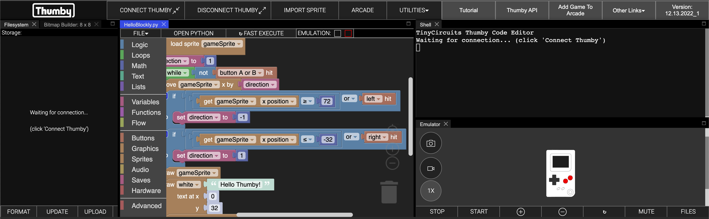
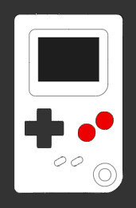
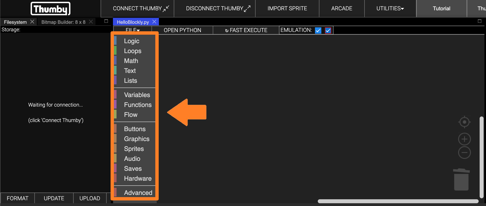
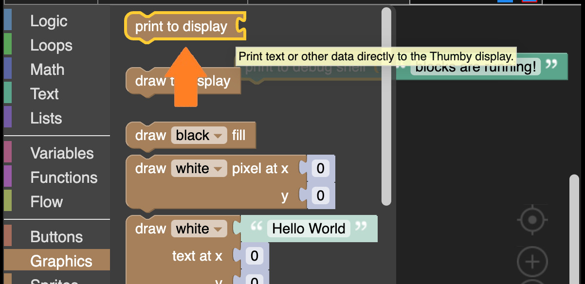
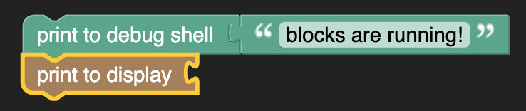
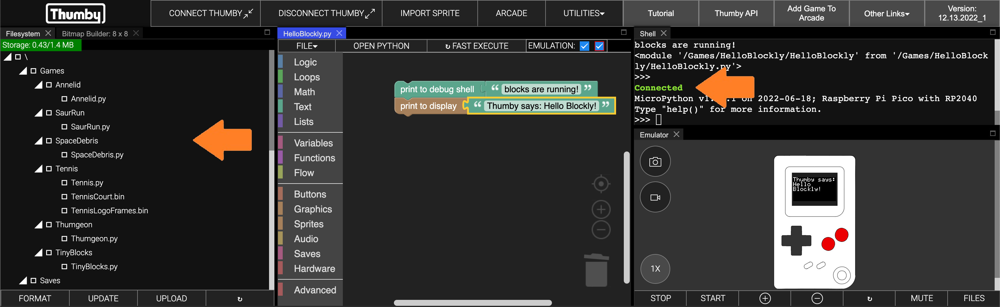
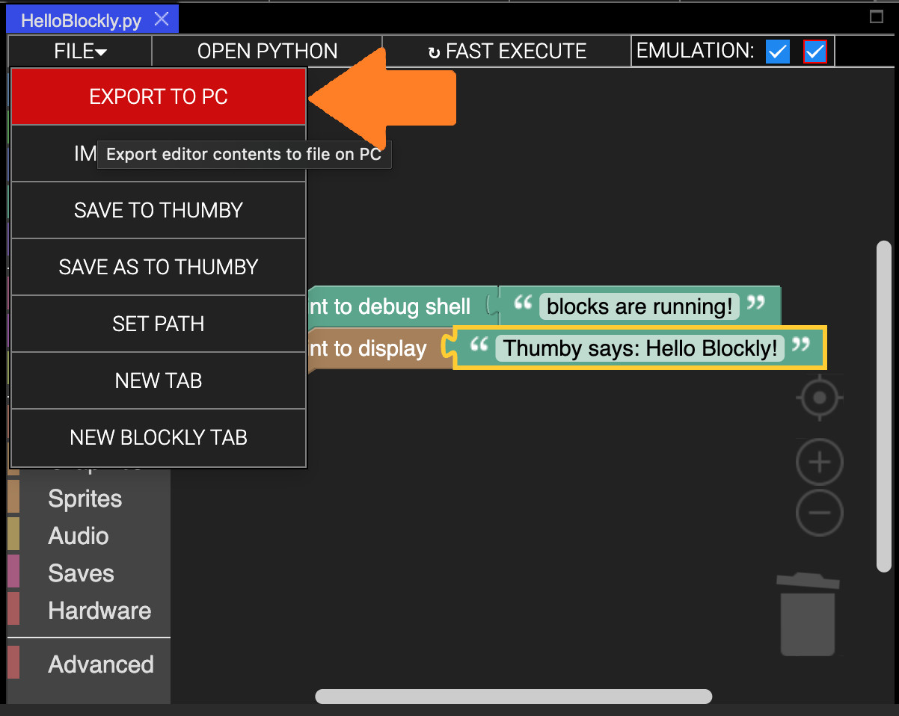

# The Basics - Getting Started with Blockly

This tutorial will get you stared with visual block programming in the Thumby Code Editor, and show you how to get the Thumby to do some fun little things!

## Getting Set Up

* Head on over to the online [Thumby Code Editor](https://code.thumby.us).
* You may be shown the Code Editor Changelog popup. Don't worry about that. Just close it!
* Next, you will get an option to select between MicroPython and Blockly editors. Select Blockly.

* You should now have an editor with some example blocks shown. Don't wory if you missed this, you can still open a new one with UTILITIES -> WIDGETS -> + BLOCKLY EDITOR:

### Running in the Emulator

Now that you have the example program open, lets try running it in the Emulator! The emulator is the picture of a Thumby in the corner. That can actually run the Thumby games!

* First, we need to make sure that the program is selected to be emulated. Make sure checkboxes next to **EMULATION: ✅ ✅** (found at the top of the editor) are both selected. The red one (on the right) is the important one, which actually activates both!

* Now you can launch the Emulator by clicking the **START** button on the bottom of the Emulator window:

* Give it a moment, and it should load up a lovely *Hello Thumby* message, with a Thumby image moving back and forth!

This will just keep playing forever.

#### Playing in the Emulator

You can play games in the Emulator just like on a Thumby! You just use the keyboard to control it instead of the buttons. Use W A S D for **up/left/down/right** and use **,** and **.** for the two buttons!:

* **W**  ⇧
* **S**  ⇩
* **A** **D**  ⇦ ⇨
* **,** **.**  🔴 🔴

The example program has some basic button actions. Make sure the Emulator is selected, then change the direction of the moving Thumby image with **left** (A) and **right** (D):

* **A** - change Thumby direction to left.
* **D** - change Thumby direction to right.

Go ahead and tap away and see it wiggle about!

#### Stopping the Emulator

If you have a game running in the Emulator, you can stop the emulation with the **STOP** button on the bottom of the Emulator window. Clicking the STOP button on the Emulator is just like turning off the power switch on your Thumby.

* Press **STOP**:

---

## Getting Started with Blockly

Now that we are set up with the basics, lets get started programming with blocks!

### Blockly Workspace

In Blockly, you piece togther logic using blocks. There are a bunch of different kinds of blocks that you can use that each do differnt things and behave in differnt ways. Some blocks connect together one after the other, and some blocks go inside other blocks. You don't need to remember the ways each kind of block is allowed to connect together as it is all automatic! All you need to do is drag the blocks around and they will automatically connect to where they are allowed to go. You can detach them by dragging them off and then putting them somewhere else. Go ahead and dray some of the blocks around. Don't worry about breaking the logic, we are going to clear it all away soon anyway!

This area where all the blocks are located and able to be dragged around and connected together is called the *workspace* and is the area which makes the logic for your game.

**Workspace:**

* Clear the workspace and start fresh. You can simply select each blocks, one by one, and press the backspace key, or you can right-click on the workspace background and select *Delete 33 Blocks* (the number might be different:

You should now have a nice clear workspace without any blocks:

Nice! Now we are ready to start adding our own blocks!

### Blockly Toolbox

To add blocks to the workspace, we need to get the blocks from somewhere! In Blockly, all the blocks are neatly organised inside the *toolbox*. You can see the toolbox here:

**Toolbox**

All the blocks in the toolbox are organised into categories. Each category contains blocks that do similar kinds of things. You can click on each category to see all the different blocks they contain!

* Try cliking on the **Text** category in the *toolbox*:

You can see that it has opened out a toolbox panel showing all the blocks about *text* that you can use. Each block has a tooltip that helps describe what the block does.

* Leave your mouse pointer over the  block until the tooltop shows up:

* Now try using that block! To use a block from the toolbox, simply drag it into the workspace area:

Now you have a block in your workspace! There is an unlimited number of each block in the toolbox. You can keep dragging them into your workspace to make new blocks.

### Building with Blocks

The  block needs something to print.

* Grab the  block from the *Text* toolbox and plug it into the  block in your workspace:

Now lets run your program and see what it does!

* Click the **START** button on the emulator just like you did before with the default program.

Unfortunately, nothing is going to show up on the Thumby emulator itself (that's coming later), but we can see the program did something because it output that "*abc*" text in the debug Shell:

These two blocks are now working together to show text in the debug Shell! This kind of block connection adds a block that *is something* to a block that *does something*. Here, we have connected a block that *is abc text* to a block that *does a print of something to the debug shell*, so both blocks together *does a print of the abc text to the debug shell*.

These debug prints can be really helpful for helping figure out what your program is doing. Its not really making the Thumby do anything, but we will get to that soon. For now, lets make it print something better than "abc".

Some blocks in blockly can have their details changed! The  block can be changed to any text! "abc" is just the example value.

* Click on the "abc" text and type in something new like "blocks are running!".

* Now you can run this again by clicking **START**.

You should see that it is now showing the new text you entered:

Nice! Now you know how to place blocks, connect them together, and change their details. Next, let's make the Thumby actually do something! We can also learn how to snap blocks together in another way.

* Open the *Graphics* category of the toolbox, which is lower down than the *Text* category you just had open.

You should see a  block. This is similar to the  block we just used, but will display text to the Thumby screen instead of the debug Shell:

* Go ahead and drag it out of the toolbox and connect it underneath the  block so that it looks like this:

Once again, we need to connect a block that *is something* so that the  block knows what to display.

* Grab another  block like before, connect it in, and change the text to something like "Thumby says: Hello Blockly", so it looks like this:

* See what that does now by clicking **START**:

We finally made the Thumby do something! Nice!

Connecting blocks like this underneath each other makes a *do semething* block run *after* another *do something* block. In Blockly, blocks run one after another from top to bottom. Both our blocks seemed to run at the same time because they ran so fast! What actually happend is "blocks are running!" was printed to the debug shell, and then, after that, "Thumby says: Hello Blockly!" was printed to the Thumby display.

There are all kinds of blocks in Blockly that do lots of different things. When you start connecting them together in interesting ways you can get the Thumby to do lots of cool things!

### Links, Hints and Tricks

If you would like to learn more about some of the blocks in Blockly, there is great interactive tutorial here: [Learn Block Coding](https://learnblockcoding.com/) which explains all about the blocks in the toolbox categories Logic, Loops, Maths, Text, Lists, Variables, and Functions. There are also some fun interactive tutorials here: [Blockly Games](https://blockly.games/turtle) which lets you get familiar with connecting blocks together with some different blocks that do some fun things.

---

Blockly supports some shortcuts to help make and arrange blocks quickly. Here are some useful ones:

* Copy selected block: **Ctrl**+**c**
* Paste copied block: **Ctrl**+**v**
* Undo last change: **Ctrl**+**z**
* Redo change: **Ctrl**+**Shift**+**z**

---

There are also some useful grey buttons on the bottom right of the workspace area. From top down are the following buttons:

* Center workspace
* Zoom in
* Zoom out
* Open recycling bin - where you can recover recently deleted blocks!

---

## Testing on a Connected Thumby ##

The emulator is super helpful for quickly testing your programs but it is even more fun to try your program on a real Thumby (if you have one). Next, let's connect your Thumby and test this program on it!

* Turn your Thumby on (switch the top power switch to the right when looking at the screen), and connect it to your PC using a Micro USB Cable.

**⚠ Note**: *Some Micro USB cables only include power and ground wires to power or charge devices - if you are having trouble connecting your Thumby in the following steps, try using a different USB cable. Test the USB cable you are using is able to transfer data by transferring files, like pictures or text files, from a different USB compatible device.*

**⚠ Note**: *Connecting your Thumby works best in Chrome or Edge. If you are having trouble connecting, make sure to try a latest version of one of those browsers.*

**⚠ Note**: *If you're on Linux, your user needs to be added to the `dialout` group. Use this command `sudo adduser $USER dialout` and restart your machine.*

* Click **'CONNECT THUMBY'** at the top:

* Select the device in the pop-up menu, and then click 'Connect':

If connection is successful, a green 'Connected' message will be printed to the debug Shell. You should also see all the files from the Thumby device load in the *Filesystem* tab:

Your Thumby is now connected! The  Thumby should be paired to the webpage so that it will auto-connect next time it is plugged in.

We can now test the program on it!

* Click the **'↻ FAST EXECUTE'** button just above the Blockly workspace:

If all goes well, you should very briefly see the "Thumby says: Hello Blockly!" message showing on the display! Your Thumby automatically resets at the end of your program.

Wonderful!

If you would like to see the message for longer, try snapping a  block from the *Flow* category underneath .

---

## Saving Your Work

Any code written in the Code Editor is saved to your local web storage, so refreshing or closing the Code Editor webpage won't erase your saved work.

**⚠ Note**: *Please avoid the few ways you could lose your work unless you have saved:*

* **DONT**: Hard reset the page (UTILITIES -> HARD RESET PAGE)
* **DONT**: Clear your local browser storage by deleting the browser cache.
* **DONT**: Close the Blockly editor tab (instead of the whole browser tab) without saving.

You can save your work by saving blockly files to your PC. Use **FILE -> EXPORT TO PC** to download a save file with all your work!

You can load it again later from the same menu by opening a new Blockly tab with **'NEW BLOCKLY TAB'**, and then clicking **'IMPORT FROM PC'**

## Further Learning

Most of the Code Editor interface works the same for MicroPython and Blockly, so you can learn more about it all here: [Code Editor Docs: Getting Started - First Program](../Code-Editor/Get-Started/).

**⚠ Note**: *The* **'IMPORT SPRITE'** *button at the top of the Code Editor isn't usable for Blockly. We will show the way to make Sprites for Blockly in the next tutorial.*

If you get stuck, you can always ask for some help from the Thumby Discord community channel found here: **[Tiny Circuits Discord](https://discord.gg/vzf3wQXVvm "Link to join the tinycircuits Discord")**.

When you are ready, head on over to the next tutorial to start with the basics for making games!

[Next Tutorial: The Simplest Game](Simplest-Game)
